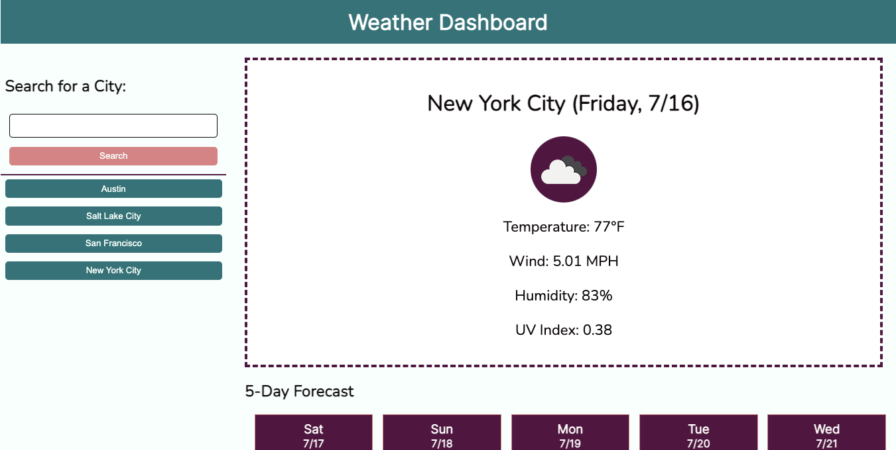

# Weather-Dashboard
<a href="https://tbetti.github.io/Weather-Dashboard/" target="_blank">Link to website</a>

When users input a city name, this app uses the OpenWeather API to display current and forecasted weather results for the city.  Each search the user makes is recorded as a button so the weather for recently searched cities can be easily accessed again.
