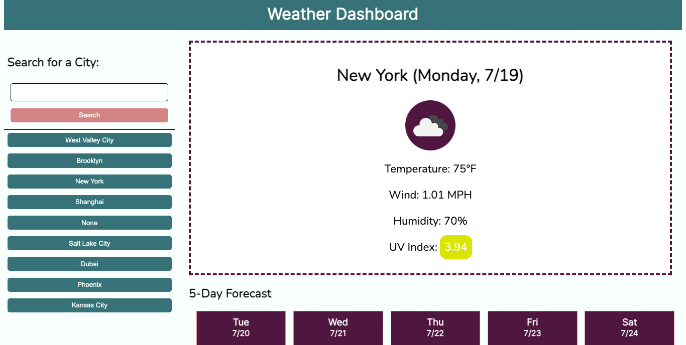

# Weather-Dashboard
<a href="https://tbetti.github.io/Weather-Dashboard/" target="_blank">Link to website</a>

<h2>Description</h2>
When users input a city name, this app uses the OpenWeather API to display current and forecasted weather results for the city.  Each search the user makes is recorded as a button so the weather for recently searched cities can be easily accessed again.

<h2>How to Use</h2>

Type the name of a city in the box and click "Search" or click a city button saved from a previous search.  The current weather conditions for the city will display first listing the temperature (F), windspeed (MPH), humidity, and UV Index. Underneath the current weather is the five-day forecast for this searched city which lists temperature, windspeed, and humidity for each of the next five days.

Clear list of previously-searched cities by clicking the "Clear Cities" button.

<figure>
    
    <figcaption>Forecasted weather</figcaption>
</figure>

<h2>Contact Creator</h2>
<ul>
    <li><b>Email:</b> tiana.bettinson@gmail.com</li>
    <li><b>LinkedIn: </b><a href="https://www.linkedin.com/in/tianabettinson/">linkedIn.com/in/TianaBettinson</a></li>
</ul>

<h2>License</h2>

View the <a href="./License">MIT License</a> here

